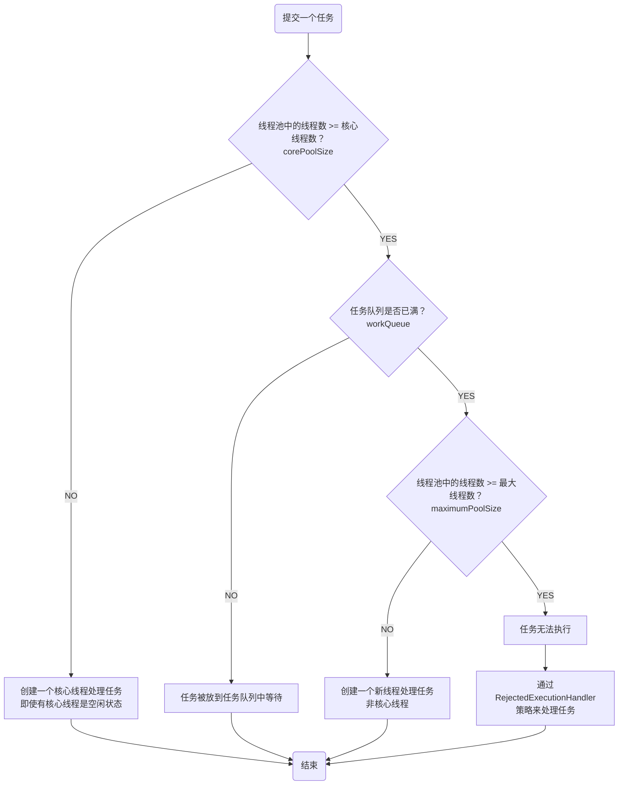
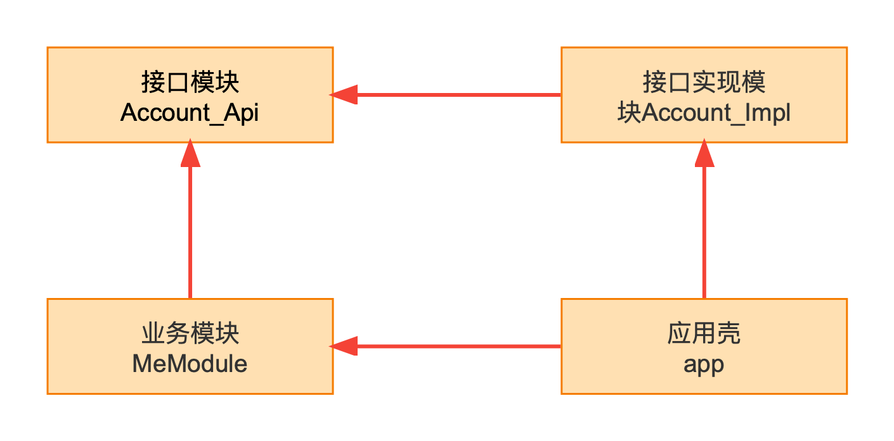
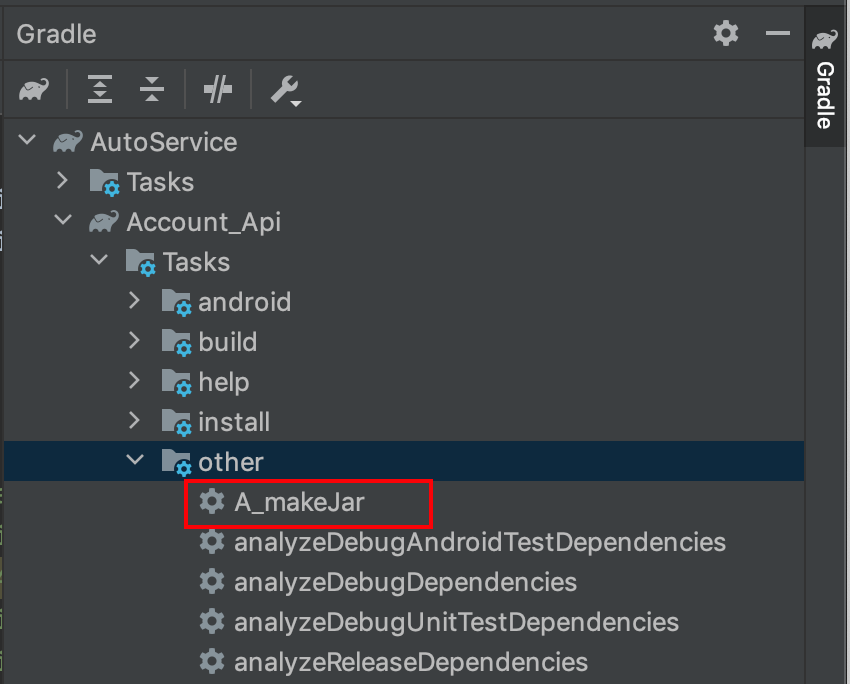
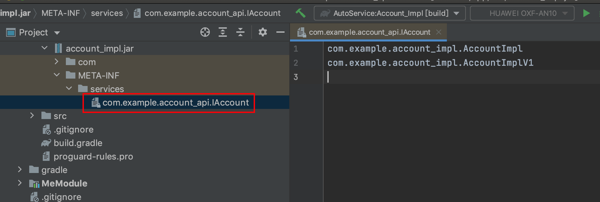
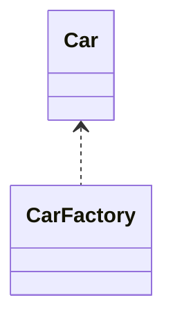

[TOC]

------

# 一、Android

## 四大组件

### 1、Activity

### 2、BroadcastReceiver

### 3、Service

### 4、Provider

## 布局

### 1、LinearLayout

### 2、RelativeLayout

[Android RelativeLayout中控件动态定位](https://juejin.cn/post/7046017648651403278)

### 3、FrameLayout

### 4、ConstraintLayout

### 5、CoordinatorLayout

### 6、MotionLayout

## 控件

### RecyclerView

#### 基本组成

- `RecyclerView.ViewHolder`

  `ViewHolder`包装了`View`

- `RecyclerView.Adapter`

  | 需要实现的相关方法   | 说明                   |
  | -------------------- | ---------------------- |
  | `onCreateViewHolder` | 创建`ViewHolder`       |
  | `onBindViewHolder`   | 给`ViewHolder`绑定数据 |
  | `getItemCount`       | 返回列表数据的size大小 |

- `LayoutManager`

  | 类型                         | 描述       |
  | ---------------------------- | ---------- |
  | `LinearLayoutManager`        | 线性样式   |
  | `GridLayoutManager`          | 栅格样式   |
  | `StaggeredGridLayoutManager` | 瀑布流样式 |

#### ItemDecoration

[Android的clipToPadding与clipChildren](https://juejin.cn/post/7057545293252247566)

## View体系

[Android View监听按键返回事件](https://juejin.cn/post/7044528606227202084)

### View的简介

View是Android所有控件的基类，同时ViewGroup也是继承自View。

### 坐标系

####  Android坐标系

* 以**屏幕**的左上角为起点；
* 通过`MotionEvent`类的`getRawX()`和`getRawY()`获取的。

#### 视图坐标系

* 以**父布局**的左上角作为起点；

* `View`通过`getHeight()`和`getWidth()`获取自身的宽高；

* `View`通过`getLeft()`、`getTop()`、`getBottom()`和`getRight()`获取View自身左上下右边到**父布局坐标原点**的距离；

* `MotionEvent`的`getX()`、`getY()`获取按下位置距离**View自身原点**的距离。

### View的滑动

#### 基本思想

当触摸事件传递到`View`时，系统记录下触摸点的坐标，手指移动时记录下移动后的触摸的坐标并计算偏移量，并通过偏移量来修改View的坐标。

#### 实现方案

1. `layout`

   调用`View`的`layout（getLeft() + offsetX，getTop() + offsetY, getRight() + offsetX, getBottom() + offsetY）`，设置View上下左右的位置，其中`offsetX/offsetY`是手势移动的距离。

2. `offsetLeftAndRight()`与`offsetTopAndBottom()`

   使用了第一种`layout`类似。

3. #### `LayoutParams`（改变布局参数）

   `LayoutParams`保存这`View`的布局参数，改变该对象中的属性值，然后`setLayoutParams(layoutParams)`即可改变`View`的属性。

4. 动画

5. `scollTo`与`scollBy`

   `scollTo(x,y)`表示移动到一个具体的坐标点，而`scollBy(dx,dy)`则表示移动的增量为`dx`、`dy`。`scollTo`、`scollBy`移动的是`View`的内容，如果在`ViewGroup`中使用则是移动他所有的子`View`。

   这两个方法进行滑动时，整个过程是瞬时完成的，体验不好，很少使用。但是会使用在当列表滑动了特别多之后，双击某个地方触发回到顶部的场景中，可用这个方法先瞬间回到离顶部距离不大的地方，然后再使用其他方法进行顺滑回到顶部，这样效果比单一的实现方案更优秀。

6. `Scroller`

   具体的使用可以看如下的样例，已对代码进行了注释：

   ```java
   public class ScrollerView extends View {
       private Scroller scroller;
   
       public ScrollerView(Context context) {
           this(context, null);
       }
   
       public ScrollerView(Context context, @Nullable AttributeSet attrs) {
           this(context, attrs, 0);
       }
   
       public ScrollerView(Context context, @Nullable AttributeSet attrs, int defStyleAttr) {
           super(context, attrs, defStyleAttr);
           init();
       }
   
       private void init() {
           // step1：初始化时创建对象
           scroller = new Scroller(getContext());
       }
   
       // step3：draw时会调用该方法
       @Override
       public void computeScroll() {
           super.computeScroll();
           // computeScrollOffset为true表示动画没有结束
           if (scroller.computeScrollOffset()) {
               // 注意需要调用父容器的scrollTo方法
               ((View) getParent()).scrollTo(scroller.getCurrX(), scroller.getCurrY());
               // 继续触发draw，从而实现移动
               invalidate();
           }
       }
   
       // step2：外部调用该自定义的方法，方法中触发scroller.startScroll()
       public void smoothScrollTo(int destX, int destY) {
           int scrollX = getScrollX();
           int dx = destX - scrollX;
           int scrollY = getScrollY();
           int dy = destY - scrollY;
           // dx, dy正值表示往屏幕坐标原点方向移动
           scroller.startScroll(scrollX, scrollY, dx, dy, 3000);
           // 触发绘制
           invalidate();
       }
   }
   ```

   `Scroller`起到了类似属性动画中估值器的作用，根据需要移动的距离，以及所需要的时间，计算出当前时间节点`View`需要移动到的坐标位置，最后再借助`View`的`scrollTo`方法实现移动，这里需要注意，其实是当前`View`的父容器去调用`scrollTo`的。使用时只需要调用该自定义`View`新增的`smoothScrollTo`即可。

### 事件分发机制

#### 三个重要方法

|                  方法                   |                             备注                             |
| :-------------------------------------: | :----------------------------------------------------------: |
|  `dispatchTouchEvent(MotionEvent ev)`   |                       用来进行事件分发                       |
| `onInterceptTouchEvent(MotionEvent ev)` | 用来进行事件的拦截，在`dispatchTouchEvent()`方法中调用；<br />`View`没有提供该方法，该方法是在`ViewGroup`中；<br />返回`true`：拦截；返回`false`：不拦截，默认不拦截；<br />如果拦截了，则走当前`ViewGroup`的`onTouchEvent()`方法。 |
|        `onTouchEvent(Motion Ev)`        |     用来处理点击事件，在`dispatchTouchEvent()`方法中调用     |

#### 事件分发由上往下传递

1. 用来处理触摸事件，在`dispatchTouchEvent()`方法中调用；
2. `ViewGroup`一般只考虑`onInterceptTouchEvent()`方法，因为一般我们不会去重写`dispatchTouchEvent()`方法；
3. 根`ViewGroup`首先把点击事件交给`dispatchTouchEvent()`方法，如果该`ViewGroup`的`onInterceptTouchEvent()`返回`true`则交给自身的`onTouchEvent()`处理，否则传递给子元素的`dispatchTouchEvent()`处理，如此反复，直到最底层`View`，`View`的`dispatchTouchEven()`一般最终会调用`onTouchEvent()`。

#### 事件处理由下往上传递

1. 最底层的`View`的`onTouchEvent`返回`true`，则表示消费了事件；返回`false`，表示不做处理，则传递给父`View`的`onTouchEvent`处理，如果父`View`的`onTouchEvent`还是返回`false`，则继续向上传递，如此反复；
2. 如果给`View`添加了`onTouchListener`并且`onTouch`返回了`true`，则`View`的`onTouchEvent`方法不会被调用，即前者的优先级高于后者；
3. 如果给`View`添加了`onClickListener`，则在执行`onTouchEvent`方法时会去执行`OnClickListener`的`onClick`方法，即`onClick`的优先级最低；
4. `View`的`OnTouchEvent`方法默认都会返回`true`，除非它是不可点击的`CLICLABLE`和`LONG_CLICLABLE`都为`false`，通过`OnClickLinstener`会自动将`CLICLABLE`置为`true`。

#### onTouch()和onTouchEvent()

相同点：

- 都是在`View`的`dispatchTouchEvent`中调用，前者的优先级高于后者；
- 都是`View`中处理触摸事件的`API`；

不同点：

- `onTouch()`是`onTouchListener`接口中的函数，需要用户自己实现，`onTouchEvent()`是`View`自带的接口，`Android`提供了默认实现，子`View`可进行覆写。

#### onTouchListener的onTouch()和Activity的onTouchEvent()

- 如果`onTouchListener`的`onTouch()`方法返回`true`，手放在`View`上时，`onTouch`会一遍一遍的调用；
- 如果`onTouchListener`的`onTouch()`方法返回`false`，手放在`View`上时，`onTouch()`会执行一遍，`Activity`的`onTouchEvent()`会一遍一遍的执行;
- 如果手放在`View`之外，`Activity`的`onTouchEvent()`会一遍一遍的执行。

#### 总结

`View`的事件分发机制简单来说就是一种从根节点到叶子结点的多叉`View`树遍历。同时提供了拦截机制以及根据各主要方法返回值来保证流程的可控性。各个主要对外暴露方法的优先级如下：

`dispatchTouchEvent` > `onInterceptTouchEvent`（只在`ViewGroup`中有） > `onTouch`（通过`onTouchListener`） > `onTouchEvent` >`onClick`（通过`OnClickListener`）。

### Activity与View的关系

- `Activity`持有`Window`

  `Window`是由其唯一实现类`PhoneWindow`创建的。

- `PhoneWindow`中会创建`DecorView`

  `DecorView`继承自`FrameLayout`；`DecorView`是`Window`的顶级`View`；根据不同情况给`DecorView`加载不同的布局。

- `DecorView`的布局中包含`@android:id/content`

  用于放置`Activity`中用户创建的布局。

### 绘制

#### 三大流程

##### onMeasure

MeasureSpec类

| 字段       |                             意义                             |
| ---------- | :----------------------------------------------------------: |
| `specMode` | View的测量模式（有如下三种）：<br />**UNSPECIFIED**：未指定<br />**AT_MOST**：最大模式，对应于`wrap_content`属性，只要尺寸不超过父控件允许的最大尺寸就行<br />**EXACTLY**：精确模式，对应于`match_parent`模式和具体的数值，父容器测量出`View`所需要的大小，也就是`sepcSize`的值 |
| `specSize` |                        View的测量大小                        |


##### onLayout

##### onDraw

#### Canvas

##### 范围裁剪

方法有`clipRect`、`clipPath`

##### 几何变换

几何的变换本质是对坐标系的变换，而不是对画布的变换，所以在进行多个变换时需要按照逆序进行写代码，下面是几种变换的方法。

|     方法      | 描述 |
| :-----------: | :--: |
| `translate()` | 平移 |
|  `rotate()`   | 旋转 |
|   `scale()`   | 缩放 |
|   `skew()`    | 偏斜 |

需要注意所有View是**共用**一个画布，所以在变换前需要使用调用`Canvas.save()`，完成当前绘制之后，使用`Canvas.restore()`进行坐标系的恢复。

下面是一个文字需要旋转一定角度的自定义TextView的实现样例：

```java
public class RotateTextView extends AppCompatTextView {
  	// 忽略构造函数，以及实际角度需要通过自定义属性或者对外暴露方法来传入
  
    @Override
    protected void onDraw(Canvas canvas) {
        canvas.save();
        // 以View的中心为旋转点，旋转45度
        canvas.rotate(45, getMeasuredWidth() >> 1, getMeasuredHeight() >> 1);
        super.onDraw(canvas);
        canvas.restore();
    }
}
```

XML布局中使用该自定义控件

```xml
<com.example.android.viewsystem.cumstom.RotateTextView
    android:background="@android:color/holo_red_light"
    android:id="@+id/rotate_view"
    android:layout_width="100dp"
    android:layout_height="100dp"
    android:layout_centerInParent="true"
    android:gravity="center"
    android:text="Hello World!" />
```

显示效果


##### 绘制内容

可以直接看`Canvas`类中以`draw`开头的众多方法。

#### Paint

#### Path

### 自定义

#### 自定义View

自定义`View`包含自定义`View`和自定义`ViewGroup`，其中自定义`View`又可以细分为继承系统控件的和继承`View`的。

- 继承系统控件的自定义View

  一般情况下我们在`onDraw()`方法中进行处理。

- 继承View的自定义View

  - 不仅要实现`onDraw()`方法，还要考虑`wrap_content`属性以及`padding`属性的设置，`wrap_content`的适配在`onMeasure()`中处理，`padding`的适配在`onDraw()`中处理。
  - 为了方便配置自定义`View`，还可以对外提供自定义属性，基本步骤是：在`value`目录下创建`attrs.xml`来添加自定义属性，在自定义`View`的构造方法中解析自定义属性。
  - 如果要改变触摸事件的逻辑，还要重写`onTouchEvent()`等触控事件的方法。

#### 自定义组合控件

自定义组合控件就是多个控件组合在一起成为一个新的控件；主要用来解决多次重复的使用功能同一类型的布局，比如标题栏、固定样式的`Dialog`等。

定义的流程：定义`XML`布局、定义`View`、自定义属性、`XML`引用组合控件、调用组合控件的方法。

## 动画

### 1、帧动画

使用的较少，因为是逐帧动画，需要用到多张图片资源，而图片资源有比较占用Apk的大小。

### 2、视图动画

视图动画只是视觉上控件发生了移动，即当某个视图发生视图动画后，其相应的事件依然在动画前的地方。

优点是效率比较高，使用也方便。

下面是几种视图动画类型：

| 类型                 | 说明       |
| -------------------- | ---------- |
| `AlphaAnimation`     | 透明度动画 |
| `RotateAnimation`    | 旋转动画   |
| `TranslateAnimation` | 平移动画   |
| `ScaleAnimation`     | 缩放动画   |

### 3、属性动画

#### ObjectAnimator

调用其静态方法即可创建对象，对象包括一个进行动画的`View`，以及动画属性的名字；

动画属性必须要有`get`和`set`方法，内部会通过Java反射机制调用`set`函数修改对象的属性值；

如果属性没有`get`和`set`方法，可以通过自定义一个类（类中包含属性的`get`和`set`方法），对`View`进行封装。

#### ValueAnimator

该类不提供任何动画效果，它更像一个数值发生器，用来产生一定规律的数字，从而让调用者来控制动画的实现过程；

在`ValueAnimator`的`AnimatorUpdateListener`中监听数值的变化，适当的在里面设置一些控件的属性从而实现`View`的动画。

#### 动画的监听

| 方案                                   | 说明                                                         |
| -------------------------------------- | ------------------------------------------------------------ |
| `Animator.AnimatorListener`            | 动画监听接口，需要实现所有的接口方法（即使不需要用到）       |
| `AnimatorListenerAdapter`              | 上一个方法的优化，可以不用实现所有的方法，只需按需`override`方法 |
| `ValueAnimator.AnimatorUpdateListener` | 单接口方法，监听数值的变化                                   |

#### 组合动画

有时候一个完整的动画是由几个动画单元按照一定的逻辑组合在一起的，这时候就需要用到组合动画。

`AnimatorSet.play()`方法会返回组合动画建造器`AnimatorSet.Builder`；`AnimatorSet.Builder`提供的方法有`after(Animator anim)`，`after(long delay)`，`before(Animator anim)`，`with(Animator anim)`，这些方法的作用顾名思义即可。

#### XML中定义的动画

`animator`文件夹下创建`XML`文件

#### 插值器

计算出当前时间完成的百分比。

#### 估值器

计算出具体的数值。

#### 贝塞尔曲线

## 资源

## 适配

### 1、深色模式

### 2、大字体

### 3、多语言

#### 数字的本地化适配

经常会碰到数字在不同的国家地区需要展示成当地的样式（并不是每个国家或地区都是使用阿拉伯数字的），以及货币如何本地化展示？百分比的**%**是写在字符串里，还是可以直接有方法生成呢？

以上这些问题都可以使用Java提供的`java.text.NumberFormat`解决，下面是几个简单的样例：

```java
public class Test {
    public static void main(String[] args) {
        // 获取数字格式化实例 获取实例时都可以设置Locale设置特定的国家或地区，或者随系统变化（实际一般随系统变化）
        NumberFormat numberFormat = NumberFormat.getInstance(Locale.getDefault());
        // 设置保留的最大的小数位数
        numberFormat.setMaximumFractionDigits(1);
        System.out.println("数字格式化: " + numberFormat.format(123.456));

        // 获取整数格式化实例
        NumberFormat integerInstance = NumberFormat.getIntegerInstance();
        System.out.println("整数格式化: " + integerInstance.format(123.456));

        // 获取百分数格式化实例
        NumberFormat percentInstance = NumberFormat.getPercentInstance();
        // 设置保留的最小的小数位数
        percentInstance.setMinimumFractionDigits(4);
        System.out.println("百分数格式化: " + percentInstance.format(0.12345));

        // 获取货币格式化实例
        NumberFormat currencyInstance = NumberFormat.getCurrencyInstance(Locale.CHINA);
        currencyInstance.setMinimumFractionDigits(4);
        System.out.println("货币格式化: " + currencyInstance.format(123.456));
    }
}
```

输出：

```systemverilog
数字格式化: 123.5
整数格式化: 123
百分数格式化: 12.3450%
货币格式化: ￥123.4560
```

### 4、镜像

### 5、异形屏

挖孔屏、折叠屏、平板

[Android的WindowInsets](https://juejin.cn/post/7056314464445923364)

## 线程与线程池

### 线程

创建线程的三种方式分别是：

* 实现`Runnable`

* 继承`Thread`

* 实现`Callable`，使用`FutureTask`封装，然后`FutureTask`的`get()`方法获取返回值

  该方案适用于想要有返回值的场景。

下面给出具体的实现代码样例

```java

class ThreadTest {
    public static void main(String[] args) {
        createThreadMethodOne();
        createThreadMethodTwo();
        createThreadMethodThree();
    }

    // 方法1：实现Runnable
    private static void createThreadMethodOne() {
        Thread thread = new Thread(new Runnable() {
            @Override
            public void run() {
                System.out.println("create thread method one.");
            }
        });
        thread.start();
    }

    // 方法2：继承Thread
    private static void createThreadMethodTwo() {
        new ThreadTwo().start();
    }

    private static class ThreadTwo extends Thread {
        @Override
        public void run() {
            System.out.println("create thread method two.");
        }
    }

    // 方法3：实现Callable，使用FutureTask封装，然后FutureTask的get()方法获取返回值
    private static void createThreadMethodThree() {
        FutureTask<String> futureTask = new FutureTask<>(new Callable<String>() {
            @Override
            public String call() throws Exception {
                return "create thread method three.";
            }
        });
        Thread thread = new Thread(futureTask);
        thread.start();
        try {
            String result = futureTask.get();
            System.out.println(result);
        } catch (Exception e) {
            e.printStackTrace();
        }
    }
}
```

虽然创建线程有上面三种方案，但在实际场景中，由于直接创建线程会导致线程的数量难以控制，同时创建线程又比较消耗资源的，所以有了线程池的概念。

### 线程池

创建线程池的类是`ThreadPoolExecutor`，如下所示

```java
public class ThreadPoolTest {
    public static void main(String[] args) {
        ThreadPoolExecutor threadPoolExecutor = new ThreadPoolExecutor(5, 20, 10, TimeUnit.SECONDS, new LinkedBlockingQueue<>(), Executors.defaultThreadFactory());
        for (int i = 0; i < 10; i++) {
            int task = i;
            threadPoolExecutor.execute(new Runnable() {
                @Override
                public void run() {
                    System.out.println("thread " + Thread.currentThread().getName() + " execute " + "task " + task);
                }
            });
        }
    }
}

```

输出如下

```systemverilog
thread pool-1-thread-1 execute task 0
thread pool-1-thread-2 execute task 1
thread pool-1-thread-3 execute task 2
thread pool-1-thread-4 execute task 3
thread pool-1-thread-5 execute task 4
thread pool-1-thread-1 execute task 5
thread pool-1-thread-2 execute task 6
thread pool-1-thread-2 execute task 8
thread pool-1-thread-4 execute task 9
thread pool-1-thread-3 execute task 7
```

可以看出，多线程中，`task`创建的顺序和在线程池中被线程执行的顺序不一定是一致的，后面创建的`task`可能被先执行。

下面逐一看`ThreadPoolExecutor`构造参数

|      参数      |    含义    |                             说明                             |
| :-------------: | :--------: | :----------------------------------------------------------: |
|  `corePoolSize`  | 核心线程数 | 默认情况下，核心线程会一直存活（即使是空闲状态），除非设置了`allowCoreThreadTimeOut`为`true`，`keepAliveTime`将会作用于核心线程 |
| `maximumPoolSize` | 最大线程数 | 当活动线程达到该值后，后续新任务会被阻塞，具体阻塞策略看线程池的`RejectedExecutionHandler`参数实现类 |
|  `keepAliveTime`  | 非核心线程的闲置超时时间 | 超过该时常，非核心线程将会被回收，当设置了`allowCoreThreadTimeOut`为`true`，该参数对核心线程同样适用 |
|      `unit`      | `keepAliveTime`参数的时间单位 | 如`TimeUnit.MILLISECONDS`，`TimeUnit.SECONDS`，`TimeUnit.MINUTES` |
|    `workQueue`    | 任务队列 | 通过线程池的`execute()`方法提交的`Runnable`对象将存放在该参数中 |
|  `threadFactory`  | 线程工厂 | 用于为线程池创建线程 |

`RejectedExecutionHandler`主要有如下几个实现子类，当然也可以自定义实现

|          类           |                             特点                             |
| :-------------------: | :----------------------------------------------------------: |
|     `AbortPolicy`     | 不执行提交的`task`，直接抛出`RejectedExecutionException`异常 |
|    `DiscardPolicy`    |              静默的扔掉提交的`task`，无任何响应              |
| `DiscardOldestPolicy` | 移除任务队列中最早的`task`，然后将新提交的`task`添加到任务队列中 |
|  `CallerRunsPolicy`   |     直接使用线程池调用方所在的线程执行`task`的`run`方法      |

想知道线程池的构造参数是如何相互配合的，就需要了解线程池的工作原理



通过流程图，可以看出处理任务的优先级是：**核心线程** > **任务队列** >**最大线程数**。另外当线程池的线程数大于核心线程数时，即存在非核心线程时，当其空闲时间超过了闲置超时时常，将会被终止；核心线程是否会终止取决于是否设置了`allowCoreThreadTimeOut`为`true`，核心线程默认是不会被终止的。

由于`ThreadPoolExecutor`的构造函数需要传递多个参数，如果合理的设定又有一定的难度，所以平时在实际使用中通常情况下并不直接使用`ThreadPoolExecutor`来创建线程池，而是使用Java已经内置的四种类型的线程池（即部分参数已经配置好，只需要配置未配置的参数）；下面是这几种线程池的特点以及相应的使用场景

|                 类型                 |                             特点                             |                  使用场景                  |
| :----------------------------------: | :----------------------------------------------------------: | :----------------------------------------: |
| `SingleThreadExecutor`单线程化线程池 | 线程数量固定**1个**（1个核心线程，无非核心线程）；任务队列无大小限制 | 单线程，需要任务严格按照**顺序执行**的场景 |
|     `FixedThreadPool`定长线程池      | 线程数量固定（核心线程固定，无非核心线程）；任务队列无大小限制 |           **控制线程最大并发数**           |
| `ScheduledExecutorService`定时线程池 | 线程数量不定（核心线程固定，非核心线程数量无限制（闲置马上回收））； |        执行**定时**或**周期性**任务        |
|     `CachedThreadPool`缓存线程池     | 线程数量不定（无核心线程，非核心线程数量不定）；由于都是非核心线程，所以只有无线程可用时才新建线程；有线程空闲时直接使用空闲线程；灵活回收空闲线程该（默认60秒超时，全部线程回收时，线程池将几乎不占用系统资源） |      执行**数量多**、**耗时少**的任务      |

`SingleThreadExecutor`创建示例

```java
public class ThreadPoolTest1 {
    public static void main(String[] args) {
        ExecutorService singleThreadExecutor = Executors.newSingleThreadExecutor();
        for (int i = 0; i < 10; i++) {
            int task = i;
            singleThreadExecutor.execute(new Runnable() {
                @Override
                public void run() {
                    System.out.println("thread " + Thread.currentThread().getName() + " execute " + "task " + task);
                }
            });
        }
    }
}
```

输出如下

```systemverilog
thread pool-1-thread-1 execute task 0
thread pool-1-thread-1 execute task 1
thread pool-1-thread-1 execute task 2
thread pool-1-thread-1 execute task 3
thread pool-1-thread-1 execute task 4
thread pool-1-thread-1 execute task 5
thread pool-1-thread-1 execute task 6
thread pool-1-thread-1 execute task 7
thread pool-1-thread-1 execute task 8
thread pool-1-thread-1 execute task 9
```

从输出可以看出，`task`是严格按照提交的顺序执行的。

`FixedThreadPool`创建示例

```java
public class ThreadPoolTest2 {
    public static void main(String[] args) {
        ExecutorService fixedThreadPool = Executors.newFixedThreadPool(5);
        for (int i = 0; i < 10; i++) {
            int task = i;
            fixedThreadPool.execute(new Runnable() {
                @Override
                public void run() {
                    System.out.println("thread " + Thread.currentThread().getName() + " execute " + "task " + task);
                }
            });
        }
    }
}
```

输出

```systemverilog
thread pool-1-thread-2 execute task 1
thread pool-1-thread-1 execute task 0
thread pool-1-thread-3 execute task 2
thread pool-1-thread-4 execute task 3
thread pool-1-thread-5 execute task 4
thread pool-1-thread-2 execute task 5
thread pool-1-thread-1 execute task 6
thread pool-1-thread-1 execute task 9
thread pool-1-thread-3 execute task 8
thread pool-1-thread-2 execute task 7
```

从输出可以看出，也再次说明在多线程中，`task`创建的顺序和在线程池中被线程执行的顺序不一定是一致的。

`ScheduledExecutorService`创建示例

```java
public class ThreadPoolTest3 {
    public static void main(String[] args) {
        System.out.println("start time: " + System.currentTimeMillis());
        ScheduledExecutorService scheduledExecutorService = Executors.newScheduledThreadPool(5);
        Runnable delayTask = new Runnable() {
            @Override
            public void run() {
                System.out.println("delayTask current time: " + System.currentTimeMillis());
            }
        };
        // 延时5秒执行该任务
        scheduledExecutorService.schedule(delayTask, 5, TimeUnit.SECONDS);

        Runnable periodTask = new Runnable() {
            @Override
            public void run() {
                System.out.println("periodTask current time: " + System.currentTimeMillis());
            }
        };
        // 延时10秒后开始以1秒为周期重复执行任务
        scheduledExecutorService.scheduleAtFixedRate(periodTask, 10, 1, TimeUnit.SECONDS);
    }
}
```

输出如下

```systemverilog
start time: 1656749188976
delayTask current time: 1656749193989
periodTask current time: 1656749198990
periodTask current time: 1656749199990
periodTask current time: 1656749200990
periodTask current time: 1656749201990
periodTask current time: 1656749202990
periodTask current time: 1656749203990
...
```

可以看到，该线程池可以延迟执行任务（调用`schedule()`方法），以及周期性执行任务（调用`scheduleAtFixedRate()`方法）。

`CachedThreadPool`创建示例

```java
public class ThreadPoolTest4 {
    public static void main(String[] args) {
        ExecutorService cachedThreadPool = Executors.newCachedThreadPool();
        for (int i = 0; i < 10; i++) {
            int task = i;
            cachedThreadPool.execute(new Runnable() {
                @Override
                public void run() {
                    System.out.println("thread " + Thread.currentThread().getName() + " execute " + "task " + task);
                }
            });
        }
    }
}
```

输出

```systemverilog
thread pool-1-thread-1 execute task 0
thread pool-1-thread-1 execute task 1
thread pool-1-thread-1 execute task 3
thread pool-1-thread-2 execute task 2
thread pool-1-thread-2 execute task 5
thread pool-1-thread-3 execute task 4
thread pool-1-thread-1 execute task 6
thread pool-1-thread-1 execute task 8
thread pool-1-thread-3 execute task 7
thread pool-1-thread-2 execute task 9
```

从中可以看到，线程池只创建了3个线程来执行这些任务，即优先使用已有线程来执行任务。

在了解了以上几种线程池之后，工作中就可以根据实际的业务场景进行合理的选择使用了。

## 进程间通信

## 持久化存储

## 序列化与反序列化

## 系统服务

### 1、AMS

### 2、WMS

[Android的WindowManager](https://juejin.cn/post/7040318918971359239)

### 3、PMS

## 三方库

### Lottie

动画库

### ARouter

阿里巴巴开源的组件路由库

### Rxjava

异步框架、链式调用；Observable在空间纬度上重新组织事件的能力；Observable在时间纬度上重新组织事件的能力。

参考博客：「给Android开发者的RxJava详解」、「RxJava沉思录：用了这么久，你认为RxJava真的好用吗」

## 架构

### MVC

### MVP

### PVVM

### MPI

## 趋势

### Java到Kotlin

### Jetpack Compose

## 组件化

### AutoService

App组件化过程中，需要合理解决组件间的依赖，组件间应做到合理的暴露接口和隐藏实现细节。`AutoService`是Google官方提供的暴露接口，隐藏实现的解决方案。下面通过一个案例来进行`AutoService`使用说明：

工程总共四个模块（实际项目中不同模块一般是分别属于不同的代码工程，通过`maven`等方式进行引用，这里为了方便直接写在一个工程中，模块通过生成jar包，并引用jar包来形成依赖），分别是`Account_Api`
、`Account_Impl`、`MeModule`、`app`，其依赖关系如下



可以看到业务模块`MeModule`只需要依赖接口模块`Account_Api`，并不用需要依赖其实现。下面来看看如何使用`AutoService`来实现。

`Account_Api`模块中

定义一个接口（该模块仅仅定义接口，没有实现）

```java
package com.example.account_api;

public interface IAccount {
    String getName();
}
```

在该模块的`build.gradle`文件中写如下脚本，用于生成jar包

```groovy
// Copy类型
task A_makeJar(type: Copy) {
    // 删除存在的
    delete 'build/libs/account_api.jar'
    // 设置拷贝的文件
    from('build/intermediates/aar_main_jar/release/')
    // 打进jar包后的文件目录
    into('build/libs/')
    // 将classes.jar放入build/libs/目录下
    // include, exclude参数来设置过滤
    //（我们只关心classes.jar这个文件）
    include('classes.jar')
    // 重命名
    rename('classes.jar', 'account_api.jar')
}

A_makeJar.dependsOn(build)
```

可以在AS控制面板的右边看到对应名称的`task`，点击即可



然后复制生成的`build/libs/jar`包到`MeModule`模块的`libs`文件夹下进行引用，记得需要在`build.gradle`文件中加上如下依赖才能生效

```groovy
dependencies {
    implementation fileTree(dir: "libs", includes: ["*.jar"])
}
```

`MeModule`调用接口示例代码

```java
package com.example.memodule;

import com.example.account_api.IAccount;

import java.util.ServiceLoader;

public class MeCenter {
    public static String getName() {
        StringBuilder stringBuilder = new StringBuilder();
        // 加载对应接口的所有实现类
        ServiceLoader<IAccount> load = ServiceLoader.load(IAccount.class);
        // 遍历所有实现类
        for (IAccount iAccount : load) {
            stringBuilder.append(iAccount.getName()).append(",");
        }
        return stringBuilder.toString();
    }
}
```

可以看到`MeModule`仅仅是引用了`Account_Api`模块。

接着看`Account_Impl`这个实现接口的模块

首先在`build.gradle`中添加依赖以及生成jar包的脚本

```groovy
dependencies {
    implementation 'com.google.auto.service:auto-service:1.0-rc6'
    // 用于根据注解AutoService生成对应的META—INF文件
    annotationProcessor 'com.google.auto.service:auto-service:1.0-rc6'
}

// Copy类型
task A_makeJar(type: Copy) {
    // 删除存在的
    delete 'build/libs/account_impl.jar'
    // 设置拷贝的文件
    from('build/intermediates/aar_main_jar/release/')
    // 打进jar包后的文件目录
    into('build/libs/')
    // 将classes.jar放入build/libs/目录下
    // include, exclude参数来设置过滤
    //（我们只关心classes.jar这个文件）
    include('classes.jar')
    // 重命名
    rename('classes.jar', 'account_impl.jar')
}

A_makeJar.dependsOn(build)
```

下面是`IAccount`接口的一个具体实现类

```java
package com.example.account_impl;

import com.example.account_api.IAccount;
import com.google.auto.service.AutoService;

@AutoService(IAccount.class)
public class AccountImpl implements IAccount {
    @Override
    public String getName() {
        return "Jack";
    }
}
```

代码的关键是使用了注解`AutoService`，注解的括号内填写该类具体是实现哪个接口。另外注意，一个接口是可以有多个实现的（不过一般实际业务中习惯对外暴露的接口内部是一个实现类），如下是上面接口的另一个实现

```java
package com.example.account_impl;

import com.example.account_api.IAccount;
import com.google.auto.service.AutoService;

@AutoService(IAccount.class)
public class AccountImplV1 implements IAccount {
    @Override
    public String getName() {
        return "JackV1";
    }
}
```

编译该模块之后，可以看到会生成对应接口的一个META文件，里面的内容是对应接口的实现类完整路径



`Account_Impl`模块打出来的jar包提供给`app`模块引用（如果不引用，可以想象最后的apk中是没有接口实现类的），同时`app`模块也引用`MeModule`模块。最后是app模块的测试代码

```java
package com.example.autoservice;

import com.example.memodule.MeCenter;

class Test {
    public static void main(String[] args) {
        System.out.println("name: " + MeCenter.getName());
    }
}

// 输出为
// name: Jack,JackV1,
```

从输出可以看出两点，第一是确实调用到了具体的接口实现，第二是接口实现是可以有多个的。

以上就是AutoService的简单使用了，是不是感觉实现组件化，接口的暴露与实现的隐藏也没那么复杂了。

## 动态化

## 跨平台

## 热修复

## 优化

### 启动优化

[【Android】Application的几点见解](https://juejin.cn/post/7087601351001112583)

### APK大小优化

### 内存优化

### 布局优化

## APT

Annotation Processing Tool注解处理器

## AOP

Aspect Oriented Programing面向切片编程

## 国家政策

### 适老化

### 个保法

### 防沉迷

儿童模式、未成年模式、儿童长大

## DeepLink

## Kotlin

## Jetpack

分为架构、UI、行为、基础四大部分

### DataBinding

### Lifecycles

### LiveData

### Navigation

### Room

### Paging

### ViewModel

### WorkManager

# 二、Java

## 原始数据类型

## 流程控制语句

## 类、接口、枚举

[Java创建对象的四种方式](https://juejin.cn/post/7079688614048694302)

## 集合

## 泛型

## 反射

## 注解

## 多线程

## 函数式编程

## IO

## 异常体系

## 类加载

## 垃圾收集GC

## JDK工具

# 三、设计模式

## 类的关系

### 1、依赖

依赖关系最弱的一种；类A的某个成员方法的「返回值」、「形参」、「局部变量」是B，或者调用B的「静态方法」，则表示类A依赖了B，类B不会成为类A的成员属性，如下`CarFactory`对`Car`的依赖：

```java
public class Car {
    private static final String TAG = "Car";

    private String brand = "Audi";

    public static String getTag() {
        return TAG;
    }

    public String getBrand() {
        return brand;
    }

    public void setBrand(String brand) {
        this.brand = brand;
    }
}

public class CarFactory {
    // Car作为返回值
    public Car create() {
        return new Car();
    }

    // Car作为方法入参数
    public void changeBrand(Car car) {
        car.setBrand("BWM");
    }

    public String getCarDefaultBrand() {
        // Car作为局部变量
        Car car = new Car();
        return car.getBrand();
    }

    public void printCarTag() {
        // 调用Car的静态方法
        System.out.println(Car.getTag());
    }
}
```

依赖关系使用`<..`虚线+箭头表示：



### 2、关联

### 3、聚合

### 4、组合

### 5、泛化（实现、继承）

## 设计思想SOLID

### 1、单一原则

### 2、开闭原则

### 3、里氏替换原则

### 4、接口隔离原则

### 5、依赖倒置原则

### 6、迪米特法则

## 创建型

巧记：**原来的建设工人单独抽奖**

### 1、原型模式

### 2、建造者模式

### 3、工厂模式

### 4、单例模式

[【设计模式】单例创建的五种方式](https://juejin.cn/post/7086848388100161572)

### 5、抽象工厂模式

## 结构型

巧记：**带上适当的装备组合，可以让外国侨胞享受游戏**

### 1、代理模式

### 2、适配器模式

### 3、装饰器模式

### 4、组合模式

### 5、外观模式

### 6、桥接模式

### 7、享元模式

## 行为型

巧记：**多次的命令和责备中，车模见状慌忙解开衣物**

### 1、迭代器模式

### 2、命令模式

### 3、责任链模式

### 4、备忘录模式

### 5、中介者模式

### 6、策略模式

### 7、模板模式

### 8、观察者模式

### 9、状态模式

### 10、访问者模式

### 11、解释器模式

# 四、重构

## 代码的坏味道

| 索引 |   坏味道中文   |                  坏味道英文                   |                           重构手法                           |
| :--: | :------------: | :-------------------------------------------: | :----------------------------------------------------------: |
|  1   |    神秘命名    |                Mysterious Name                |             改变函数声明<br>变量改名<br>字段改名             |
|  2   |    重复代码    |                Duplicated Code                |              提取函数<br/>移动语句<br/>函数上移              |
|  3   |    过长函数    |                 Long Function                 | 提取函数<br/>以查询取代临时变量<br/>引入参数对象<br/>保持对象完整<br/>以命令取代函数<br/>分解条件表达式<br/>以多态取代条件表达式<br/>拆分循环 |
|  4   |  过长参数列表  |              Long Parameter List              | 以查询取代参数<br/>保持完整对象<br/>引入参数对象<br/>移除标记对象<br/>函数组合成类 |
|  5   |    全局数据    |                  Global Data                  |                           封装变量                           |
|  6   |    可变数据    |                 Mutable Data                  | 封装变量<br/>拆分变量<br/>移动语句<br/>提炼函数<br/>将查询函数和修改函数分离<br/>移除设值函数<br/>以查询取代派生变量<br/>函数组合成类<br/>函数组合成变换<br/>将引用对象改成值对象 |
|  7   |   发散式修改   |               Divergent Change                |        拆分阶段<br/>搬移函数<br/>提炼函数<br/>提炼类         |
|  8   |   霰弹式修改   |                Shotgun Surgery                | 搬移函数<br/>搬移字段<br/>函数组合成类<br/>函数组合成变换<br/>拆分阶段<br/>内联函数<br/>内联类 |
|  9   |    依恋情结    |                 Feature Envy                  |                    搬移函数<br/>提炼函数                     |
|  10  |    数据泥团    |                  Data Clumps                  |           提炼类<br/>引入参数对象<br/>保持对象完整           |
|  11  |  基本类型偏执  |              Primitive Obsession              | 以对象取代基本类型<br/>以子类取代类型码<br/>以多态取代条件表达式<br/>提炼类<br/>引入参数对象 |
|  12  |  重复的switch  |               Repeated Switches               |                     以多态取代条件表达式                     |
|  13  |    循环语句    |                     Loops                     |                        以管道取代循环                        |
|  14  |   冗余的元素   |                 Lazy Element                  |             内联函数<br/>内联类<br/>折叠继承关系             |
|  15  | 夸夸其谈通用性 |            Speculative Generality             | 折叠继承关系<br/>内联函数<br/>内联类<br/>改变函数声明<br/>移除死代码 |
|  16  |    临时字段    |                Temporary Field                |               提炼类<br/>搬移函数<br/>引入特例               |
|  17  |  过长的消息链  |                 Message Chain                 |            隐藏委托关系<br/>提炼函数<br/>搬移函数            |
|  18  |     中间人     |                  Middle Man                   |          移除中间人<br/>内联函数<br/>以委托取代超类          |
|  19  |    内幕交易    |                Insider Trading                |  搬移函数<br/>搬移字段<br/>隐藏委托关系<br/>以委托取代超类   |
|  20  |    过大的类    |                  Large Class                  |           提炼类<br/>提炼超类<br/>以子类取代类型码           |
|  21  |  异曲同工的类  | Alternative Classes with Different Interfaces |            改变函数声明<br/>搬移函数<br/>提取超类            |
|  22  |    纯数据类    |                  Data Class                   | 封装记录<br/>移除设值函数<br/>搬移函数<br/>提炼函数<br/>拆分阶段 |
|  23  |  被拒绝的馈赠  |                Refused Bequest                | 函数下移<br/>字段下移<br/>以委托取代子类<br/>以委托取代超类  |
|  24  |      注释      |                   Comments                    |           *提炼函数<br/>改变函数声明<br/>引入断言            |

### 1、神秘命名

命名绝对不是一件简单的事。

### 2、重复代码

合并重复，提高复用性。

### 3、过长函数

分解成更多的小函数；函数越长越不稳定。

### 4、过长参数列表

将相关的参数封装成对象作为入参；建造者模式来创建。

### 5、全局数据

变量的作用域越小修改越可控的。

### 6、可变数据

不可变数据优于可变数据；封装变量，然后变化的过程可被监视到。

### 7、发散式修改

当两个纬度的修改都涉及到同一个类，说明这个类的功能不单一；桥接模式就是解决两个纬度的变化问题。

### 8、霰弹式修改

对某个东西的修改，涉及到非常多的类。

### 9、依恋情结

一个类的某个方法大量的引用另一个类的字段，表现出与另一个类更加亲密的关系。

### 10、数据泥团

几个变量总是在一起出现在多个地方。

### 11、基本类型偏执

总喜欢用基本类型去表示实际的事物，有时需要封装出引用类型更加贴切。

### 12、重复的switch

如果有重复（说明多态实现时至少可以用两个方法是多态的）的switch条件判断，则有必要使用多态来替换switch了。

### 13、循环语句

高级语言出现了各种foreach、管道map/filter等实现循环的功能了。

### 14、冗余的元素

某些类可能只包含一个方法了，存在完全是冗余的了。

### 15、夸夸其谈通用性

代码存在过度的设计嫌疑。

### 16、临时字段

一个类的字段应该是在多个方法中都使用的，如果某人字段只在某个方法中某些特殊场景的使用而创建的，则有必要为其单独抽出一个类。

### 17、过长的消息链

获取一个对象，需要中间连续获取好多个对象才能拿到；可以把中间获取过程进行封装，直接提供返回最终需要的对象的方法。

### 18、中间人

一大半的接口都是委托给其他类实现，自己不干事实，可以把这个中间人去掉了。

### 19、内幕交易

模块之间大量的数据交换；考虑字段和方法所在位置是否合理、是否有感兴趣的公共部分、是否需要个第三者充当中间人

### 20、过大的类

过大的类往往是功能复杂，逻辑混乱、不好维护。

### 21、异曲同工的类

一个类的某个方法和另一个类的某个方法实现了类似的功能，完全可以合并留下一个。

### 22、纯数据类

单纯的数据类往往没什么意义，表明他的行为其实被不合理的放在了其他的类中。

### 23、被拒绝的馈赠

子类继承了父类，然后父类的某些特性又不想要，这种情况本身就不该继承；要么用代理代替继承，要么创建兄弟类，不想要的部分下移到兄弟类中。

### 24、注释

注释往往表明某部分代码自身表示不清，所以可以起到此处由坏味道提示。

## 重构手法

# 五、数据结构

## 数组

## 链表

[【代码设计】链表结构解决多流程校验](https://juejin.cn/post/7082300107256758280)

## 树

## 图

## 哈希表

# 六、算法

## 排序算法

巧计：**冒险选择插入相同的哈希值，为了尽快归来减少垃圾堆积**；[【算法】Java实现八种排序算法](https://juejin.cn/post/7083516064721534989)

### 1、冒泡排序

### 2、选择排序

### 3、插入排序

### 4、希尔排序

### 5、快速排序

### 6、归并排序

### 7、对排序

### 8、基数排序

# 七、计算机网络

## HTTP

## TCP

## IP

# 八、工程化

## 装机必备

[【工程化】Android开发电脑中都装了哪些软件](https://juejin.cn/post/7092294455742447629)

## 玩转Github

[【工程化】上传Android项目到Github](https://juejin.cn/post/7085016774483116040)

## Android Studio

[Android Studio查看Memery Indicator](https://juejin.cn/post/7044519584577093668)

## Gradle

[Android依赖冲突解决](https://juejin.cn/post/7042951122872434696)

# 九、面试题

# 十、学习资料

## Android方面

《第一行代码》

《Android开发艺术探索》

《Android进阶之光》

《Android进阶解密》

《Android进阶指北》

[BATcoder - 刘望舒](http://liuwangshu.cn)

JsonChao公众号

## Java方面

《Effective Java》

沉默王⼆-可能是2021年最全最硬核的Java面试 “备战” 资料（亮白版）

[Java程序员进阶之路](https://tobebetterjavaer.com/)

Java核心知识点学习手册

[HOW2J.CN](https://how2j.cn/)

## 设计模式方面

《Android源码设计模式解析与实战》

极客时间-设计模式之美

## 重构方面

《重构 - 改善既有代码的设计》

[31天重构学习笔记](

## 数据结构和算法方面

《算法图解》

[LABULADONG 的算法网站](https://labuladong.gitee.io/algo/)

[【扔物线课堂】HashMap源码解析](https://ke.qq.com/course/3323489#term_id=103454342)

[菜鸟教程](https://www.runoob.com/w3cnote/sort-algorithm-summary.html)

https://www.cnblogs.com/KnightsWarrior/p/31DaysOfRefactoring.html)

## 计算机网络方面

[小林coding-图解网络](https://www.xiaolincoding.com)

## 技术文章方面

[2022年博客阅读记录（围绕Android + Java）](https://juejin.cn/post/7056282748381560862)
