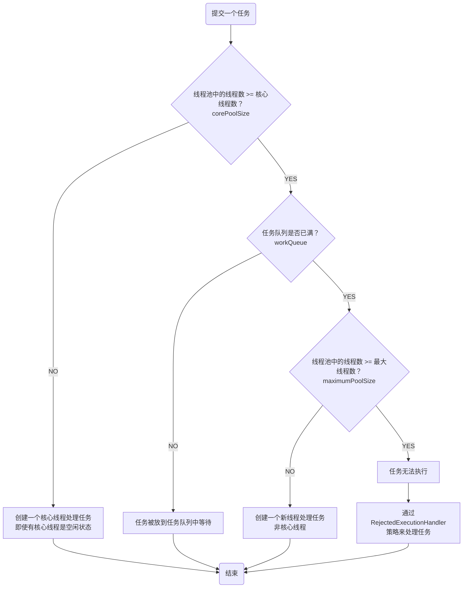
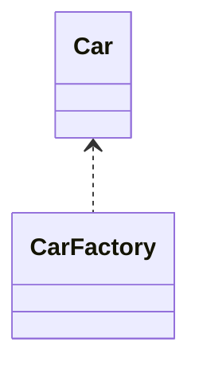

# 一、Android

## 四大组件

### 1、Activity

### 2、BroadcastReceiver

### 3、Service

### 4、Provider

## 布局

### 1、LinearLayout

### 2、RelativeLayout

[Android RelativeLayout中控件动态定位](https://juejin.cn/post/7046017648651403278)

### 3、FrameLayout

### 4、ConstraintLayout

### 5、CoordinatorLayout

### 6、MotionLayout

## 控件

### RecyclerView

[Android的clipToPadding与clipChildren](https://juejin.cn/post/7057545293252247566)

## View体系

[Android View监听按键返回事件](https://juejin.cn/post/7044528606227202084)

## 动画

### 1、帧动画

### 2、视图动画

### 3、属性动画

## 资源

## 适配

### 1、深色模式

### 2、大字体

### 3、多语言

### 4、镜像

### 5、异形屏

挖孔屏、折叠屏、平板

[Android的WindowInsets](https://juejin.cn/post/7056314464445923364)

## 线程与线程池

### 线程

创建线程的三种方式分别是：

* 实现`Runnable`

* 继承`Thread`

* 实现`Callable`，使用`FutureTask`封装，然后`FutureTask`的`get()`方法获取返回值

  该方案适用于想要有返回值的场景。

下面给出具体的实现代码样例

```java

class ThreadTest {
    public static void main(String[] args) {
        createThreadMethodOne();
        createThreadMethodTwo();
        createThreadMethodThree();
    }

    // 方法1：实现Runnable
    private static void createThreadMethodOne() {
        Thread thread = new Thread(new Runnable() {
            @Override
            public void run() {
                System.out.println("create thread method one.");
            }
        });
        thread.start();
    }

    // 方法2：继承Thread
    private static void createThreadMethodTwo() {
        new ThreadTwo().start();
    }

    private static class ThreadTwo extends Thread {
        @Override
        public void run() {
            System.out.println("create thread method two.");
        }
    }

    // 方法3：实现Callable，使用FutureTask封装，然后FutureTask的get()方法获取返回值
    private static void createThreadMethodThree() {
        FutureTask<String> futureTask = new FutureTask<>(new Callable<String>() {
            @Override
            public String call() throws Exception {
                return "create thread method three.";
            }
        });
        Thread thread = new Thread(futureTask);
        thread.start();
        try {
            String result = futureTask.get();
            System.out.println(result);
        } catch (Exception e) {
            e.printStackTrace();
        }
    }
}
```

虽然创建线程有上面三种方案，但在实际场景中，由于直接创建线程会导致线程的数量难以控制，同时创建线程又比较消耗资源的，所以有了线程池的概念。

### 线程池

创建线程池的类是`ThreadPoolExecutor`，如下所示

```java
public class ThreadPoolTest {
    public static void main(String[] args) {
        ThreadPoolExecutor threadPoolExecutor = new ThreadPoolExecutor(5, 20, 10, TimeUnit.SECONDS, new LinkedBlockingQueue<>(), Executors.defaultThreadFactory());
        for (int i = 0; i < 10; i++) {
            int task = i;
            threadPoolExecutor.execute(new Runnable() {
                @Override
                public void run() {
                    System.out.println("thread " + Thread.currentThread().getName() + " execute " + "task " + task);
                }
            });
        }
    }
}

```

输出如下

```systemverilog
thread pool-1-thread-1 execute task 0
thread pool-1-thread-2 execute task 1
thread pool-1-thread-3 execute task 2
thread pool-1-thread-4 execute task 3
thread pool-1-thread-5 execute task 4
thread pool-1-thread-1 execute task 5
thread pool-1-thread-2 execute task 6
thread pool-1-thread-2 execute task 8
thread pool-1-thread-4 execute task 9
thread pool-1-thread-3 execute task 7
```

可以看出，多线程中，`task`创建的顺序和在线程池中被线程执行的顺序不一定是一致的，后面创建的`task`可能被先执行。

下面逐一看`ThreadPoolExecutor`构造参数

|      参数      |    含义    |                             说明                             |
| :-------------: | :--------: | :----------------------------------------------------------: |
|  `corePoolSize`  | 核心线程数 | 默认情况下，核心线程会一直存活（即使是空闲状态），除非设置了`allowCoreThreadTimeOut`为`true`，`keepAliveTime`将会作用于核心线程 |
| `maximumPoolSize` | 最大线程数 | 当活动线程达到该值后，后续新任务会被阻塞，具体阻塞策略看线程池的`RejectedExecutionHandler`参数实现类 |
|  `keepAliveTime`  | 非核心线程的闲置超时时间 | 超过该时常，非核心线程将会被回收，当设置了`allowCoreThreadTimeOut`为`true`，该参数对核心线程同样适用 |
|      `unit`      | `keepAliveTime`参数的时间单位 | 如`TimeUnit.MILLISECONDS`，`TimeUnit.SECONDS`，`TimeUnit.MINUTES` |
|    `workQueue`    | 任务队列 | 通过线程池的`execute()`方法提交的`Runnable`对象将存放在该参数中 |
|  `threadFactory`  | 线程工厂 | 用于为线程池创建线程 |

`RejectedExecutionHandler`主要有如下几个实现子类，当然也可以自定义实现

|          类           |                             特点                             |
| :-------------------: | :----------------------------------------------------------: |
|     `AbortPolicy`     | 不执行提交的`task`，直接抛出`RejectedExecutionException`异常 |
|    `DiscardPolicy`    |              静默的扔掉提交的`task`，无任何响应              |
| `DiscardOldestPolicy` | 移除任务队列中最早的`task`，然后将新提交的`task`添加到任务队列中 |
|  `CallerRunsPolicy`   |     直接使用线程池调用方所在的线程执行`task`的`run`方法      |

想知道线程池的构造参数是如何相互配合的，就需要了解线程池的工作原理



通过流程图，可以看出处理任务的优先级是：**核心线程** > **任务队列** >**最大线程数**。另外当线程池的线程数大于核心线程数时，即存在非核心线程时，当其空闲时间超过了闲置超时时常，将会被终止；核心线程是否会终止取决于是否设置了`allowCoreThreadTimeOut`为`true`，核心线程默认是不会被终止的。

由于`ThreadPoolExecutor`的构造函数需要传递多个参数，如果合理的设定又有一定的难度，所以平时在实际使用中通常情况下并不直接使用`ThreadPoolExecutor`来创建线程池，而是使用Java已经内置的四种类型的线程池（即部分参数已经配置好，只需要配置未配置的参数）；下面是这几种线程池的特点以及相应的使用场景

|                 类型                 |                             特点                             |                  使用场景                  |
| :----------------------------------: | :----------------------------------------------------------: | :----------------------------------------: |
| `SingleThreadExecutor`单线程化线程池 | 线程数量固定**1个**（1个核心线程，无非核心线程）；任务队列无大小限制 | 单线程，需要任务严格按照**顺序执行**的场景 |
|     `FixedThreadPool`定长线程池      | 线程数量固定（核心线程固定，无非核心线程）；任务队列无大小限制 |           **控制线程最大并发数**           |
| `ScheduledExecutorService`定时线程池 | 线程数量不定（核心线程固定，非核心线程数量无限制（闲置马上回收））； |        执行**定时**或**周期性**任务        |
|     `CachedThreadPool`缓存线程池     | 线程数量不定（无核心线程，非核心线程数量不定）；由于都是非核心线程，所以只有无线程可用时才新建线程；有线程空闲时直接使用空闲线程；灵活回收空闲线程该（默认60秒超时，全部线程回收时，线程池将几乎不占用系统资源） |      执行**数量多**、**耗时少**的任务      |

`SingleThreadExecutor`创建示例

```java
public class ThreadPoolTest1 {
    public static void main(String[] args) {
        ExecutorService singleThreadExecutor = Executors.newSingleThreadExecutor();
        for (int i = 0; i < 10; i++) {
            int task = i;
            singleThreadExecutor.execute(new Runnable() {
                @Override
                public void run() {
                    System.out.println("thread " + Thread.currentThread().getName() + " execute " + "task " + task);
                }
            });
        }
    }
}
```

输出如下

```systemverilog
thread pool-1-thread-1 execute task 0
thread pool-1-thread-1 execute task 1
thread pool-1-thread-1 execute task 2
thread pool-1-thread-1 execute task 3
thread pool-1-thread-1 execute task 4
thread pool-1-thread-1 execute task 5
thread pool-1-thread-1 execute task 6
thread pool-1-thread-1 execute task 7
thread pool-1-thread-1 execute task 8
thread pool-1-thread-1 execute task 9
```

从输出可以看出，`task`是严格按照提交的顺序执行的。

`FixedThreadPool`创建示例

```java
public class ThreadPoolTest2 {
    public static void main(String[] args) {
        ExecutorService fixedThreadPool = Executors.newFixedThreadPool(5);
        for (int i = 0; i < 10; i++) {
            int task = i;
            fixedThreadPool.execute(new Runnable() {
                @Override
                public void run() {
                    System.out.println("thread " + Thread.currentThread().getName() + " execute " + "task " + task);
                }
            });
        }
    }
}
```

输出

```systemverilog
thread pool-1-thread-2 execute task 1
thread pool-1-thread-1 execute task 0
thread pool-1-thread-3 execute task 2
thread pool-1-thread-4 execute task 3
thread pool-1-thread-5 execute task 4
thread pool-1-thread-2 execute task 5
thread pool-1-thread-1 execute task 6
thread pool-1-thread-1 execute task 9
thread pool-1-thread-3 execute task 8
thread pool-1-thread-2 execute task 7
```

从输出可以看出，也再次说明在多线程中，`task`创建的顺序和在线程池中被线程执行的顺序不一定是一致的。

`ScheduledExecutorService`创建示例

```java
public class ThreadPoolTest3 {
    public static void main(String[] args) {
        System.out.println("start time: " + System.currentTimeMillis());
        ScheduledExecutorService scheduledExecutorService = Executors.newScheduledThreadPool(5);
        Runnable delayTask = new Runnable() {
            @Override
            public void run() {
                System.out.println("delayTask current time: " + System.currentTimeMillis());
            }
        };
        // 延时5秒执行该任务
        scheduledExecutorService.schedule(delayTask, 5, TimeUnit.SECONDS);

        Runnable periodTask = new Runnable() {
            @Override
            public void run() {
                System.out.println("periodTask current time: " + System.currentTimeMillis());
            }
        };
        // 延时10秒后开始以1秒为周期重复执行任务
        scheduledExecutorService.scheduleAtFixedRate(periodTask, 10, 1, TimeUnit.SECONDS);
    }
}
```

输出如下

```systemverilog
start time: 1656749188976
delayTask current time: 1656749193989
periodTask current time: 1656749198990
periodTask current time: 1656749199990
periodTask current time: 1656749200990
periodTask current time: 1656749201990
periodTask current time: 1656749202990
periodTask current time: 1656749203990
...
```

可以看到，该线程池可以延迟执行任务（调用`schedule()`方法），以及周期性执行任务（调用`scheduleAtFixedRate()`方法）。

`CachedThreadPool`创建示例

```java
public class ThreadPoolTest4 {
    public static void main(String[] args) {
        ExecutorService cachedThreadPool = Executors.newCachedThreadPool();
        for (int i = 0; i < 10; i++) {
            int task = i;
            cachedThreadPool.execute(new Runnable() {
                @Override
                public void run() {
                    System.out.println("thread " + Thread.currentThread().getName() + " execute " + "task " + task);
                }
            });
        }
    }
}
```

输出

```systemverilog
thread pool-1-thread-1 execute task 0
thread pool-1-thread-1 execute task 1
thread pool-1-thread-1 execute task 3
thread pool-1-thread-2 execute task 2
thread pool-1-thread-2 execute task 5
thread pool-1-thread-3 execute task 4
thread pool-1-thread-1 execute task 6
thread pool-1-thread-1 execute task 8
thread pool-1-thread-3 execute task 7
thread pool-1-thread-2 execute task 9
```

从中可以看到，线程池只创建了3个线程来执行这些任务，即优先使用已有线程来执行任务。

在了解了以上几种线程池之后，工作中就可以根据实际的业务场景进行合理的选择使用了。

## 进程间通信

## 持久化存储

## 序列化与反序列化

## 系统服务

### 1、AMS

### 2、WMS

[Android的WindowManager](https://juejin.cn/post/7040318918971359239)

### 3、PMS

## 三方库

### Lottie

动画库

### ARouter

阿里巴巴开源的组件路由库

### Rxjava

异步框架、链式调用；Observable在空间纬度上重新组织事件的能力；Observable在时间纬度上重新组织事件的能力。

参考博客：「给Android开发者的RxJava详解」、「RxJava沉思录：用了这么久，你认为RxJava真的好用吗」

## 架构

### MVC

### MVP

### PVVM

### MPI

## 趋势

### Java到Kotlin

### Jetpack Compose

## 组件化

### AutoService

App组件化过程中，需要合理解决组件间的依赖，组件间应做到合理的暴露接口和隐藏实现细节。`AutoService`是Google官方提供的暴露接口，隐藏实现的解决方案。下面通过一个案例来进行`AutoService`使用说明：

工程总共四个模块（实际项目中不同模块一般是分别属于不同的代码工程，通过`maven`等方式进行引用，这里为了方便直接写在一个工程中，模块通过生成jar包，并引用jar包来形成依赖），分别是`Account_Api`
、`Account_Impl`、`MeModule`、`app`，其依赖关系如下


可以看到业务模块`MeModule`只需要依赖接口模块`Account_Api`，并不用需要依赖其实现。下面来看看如何使用`AutoService`来实现。

`Account_Api`模块中

定义一个接口（该模块仅仅定义接口，没有实现）

```java
package com.example.account_api;

public interface IAccount {
    String getName();
}
```

在该模块的`build.gradle`文件中写如下脚本，用于生成jar包

```groovy
// Copy类型
task A_makeJar(type: Copy) {
    // 删除存在的
    delete 'build/libs/account_api.jar'
    // 设置拷贝的文件
    from('build/intermediates/aar_main_jar/release/')
    // 打进jar包后的文件目录
    into('build/libs/')
    // 将classes.jar放入build/libs/目录下
    // include, exclude参数来设置过滤
    //（我们只关心classes.jar这个文件）
    include('classes.jar')
    // 重命名
    rename('classes.jar', 'account_api.jar')
}

A_makeJar.dependsOn(build)
```

可以在AS控制面板的右边看到对应名称的`task`，点击即可


然后复制生成的`build/libs/jar`包到`MeModule`模块的`libs`文件夹下进行引用，记得需要在`build.gradle`文件中加上如下依赖才能生效

```groovy
dependencies {
    implementation fileTree(dir: "libs", includes: ["*.jar"])
}
```

`MeModule`调用接口示例代码

```java
package com.example.memodule;

import com.example.account_api.IAccount;

import java.util.ServiceLoader;

public class MeCenter {
    public static String getName() {
        StringBuilder stringBuilder = new StringBuilder();
        // 加载对应接口的所有实现类
        ServiceLoader<IAccount> load = ServiceLoader.load(IAccount.class);
        // 遍历所有实现类
        for (IAccount iAccount : load) {
            stringBuilder.append(iAccount.getName()).append(",");
        }
        return stringBuilder.toString();
    }
}
```

可以看到`MeModule`仅仅是引用了`Account_Api`模块。

接着看`Account_Impl`这个实现接口的模块

首先在`build.gradle`中添加依赖以及生成jar包的脚本

```groovy
dependencies {
    implementation 'com.google.auto.service:auto-service:1.0-rc6'
    // 用于根据注解AutoService生成对应的META—INF文件
    annotationProcessor 'com.google.auto.service:auto-service:1.0-rc6'
}

// Copy类型
task A_makeJar(type: Copy) {
    // 删除存在的
    delete 'build/libs/account_impl.jar'
    // 设置拷贝的文件
    from('build/intermediates/aar_main_jar/release/')
    // 打进jar包后的文件目录
    into('build/libs/')
    // 将classes.jar放入build/libs/目录下
    // include, exclude参数来设置过滤
    //（我们只关心classes.jar这个文件）
    include('classes.jar')
    // 重命名
    rename('classes.jar', 'account_impl.jar')
}

A_makeJar.dependsOn(build)
```

下面是`IAccount`接口的一个具体实现类

```java
package com.example.account_impl;

import com.example.account_api.IAccount;
import com.google.auto.service.AutoService;

@AutoService(IAccount.class)
public class AccountImpl implements IAccount {
    @Override
    public String getName() {
        return "Jack";
    }
}
```

代码的关键是使用了注解`AutoService`，注解的括号内填写该类具体是实现哪个接口。另外注意，一个接口是可以有多个实现的（不过一般实际业务中习惯对外暴露的接口内部是一个实现类），如下是上面接口的另一个实现

```java
package com.example.account_impl;

import com.example.account_api.IAccount;
import com.google.auto.service.AutoService;

@AutoService(IAccount.class)
public class AccountImplV1 implements IAccount {
    @Override
    public String getName() {
        return "JackV1";
    }
}
```

编译该模块之后，可以看到会生成对应接口的一个META文件，里面的内容是对应接口的实现类完整路径


`Account_Impl`模块打出来的jar包提供给`app`模块引用（如果不引用，可以想象最后的apk中是没有接口实现类的），同时`app`模块也引用`MeModule`模块。最后是app模块的测试代码

```java
package com.example.autoservice;

import com.example.memodule.MeCenter;

class Test {
    public static void main(String[] args) {
        System.out.println("name: " + MeCenter.getName());
    }
}

// 输出为
// name: Jack,JackV1,
```

从输出可以看出两点，第一是确实调用到了具体的接口实现，第二是接口实现是可以有多个的。

以上就是AutoService的简单使用了，是不是感觉实现组件化，接口的暴露与实现的隐藏也没那么复杂了。

## 动态化

## 跨平台

## 热修复

## 优化

### 启动优化

[【Android】Application的几点见解](https://juejin.cn/post/7087601351001112583)

### APK大小优化

### 内存优化

### 布局优化

## APT

Annotation Processing Tool注解处理器

## AOP

Aspect Oriented Programing面向切片编程

## 国家政策

### 适老化

### 个保法

### 防沉迷

儿童模式、未成年模式、儿童长大

## Gradle

[Android依赖冲突解决](https://juejin.cn/post/7042951122872434696)

## DeepLink

## Kotlin

## Jetpack

分为架构、UI、行为、基础四大部分

### DataBinding

### Lifecycles

### LiveData

### Navigation

### Room

### Paging

### ViewModel

### WorkManager

## Android Studio

[Android Studio查看Memery Indicator](https://juejin.cn/post/7044519584577093668)

# 二、Java

## 原始数据类型

## 流程控制语句

## 类、接口、枚举

[Java创建对象的四种方式](https://juejin.cn/post/7079688614048694302)

## 集合

## 泛型

## 反射

## 注解

## 多线程

## 函数式编程

## IO

## 异常体系

## 类加载

## 垃圾收集GC

## JDK工具

# 三、设计模式

## 类的关系

### 1、依赖

依赖关系最弱的一种；类A的某个成员方法的「返回值」、「形参」、「局部变量」是B，或者调用B的「静态方法」，则表示类A依赖了B，类B不会成为类A的成员属性，如下`CarFactory`对`Car`的依赖：

```java
public class Car {
    private static final String TAG = "Car";

    private String brand = "Audi";

    public static String getTag() {
        return TAG;
    }

    public String getBrand() {
        return brand;
    }

    public void setBrand(String brand) {
        this.brand = brand;
    }
}

public class CarFactory {
    // Car作为返回值
    public Car create() {
        return new Car();
    }

    // Car作为方法入参数
    public void changeBrand(Car car) {
        car.setBrand("BWM");
    }

    public String getCarDefaultBrand() {
        // Car作为局部变量
        Car car = new Car();
        return car.getBrand();
    }

    public void printCarTag() {
        // 调用Car的静态方法
        System.out.println(Car.getTag());
    }
}
```

依赖关系使用`<..`虚线+箭头表示：



### 2、关联

### 3、聚合

### 4、组合

### 5、泛化（实现、继承）

## 设计思想SOLID

### 1、单一原则

### 2、开闭原则

### 3、里氏替换原则

### 4、接口隔离原则

### 5、依赖倒置原则

### 6、迪米特法则

## 创建型

巧记：**原来的建设工人单独抽奖**

### 1、原型模式

### 2、建造者模式

### 3、工厂模式

### 4、单例模式

[【设计模式】单例创建的五种方式](https://juejin.cn/post/7086848388100161572)

### 5、抽象工厂模式

## 结构型

巧记：**带上适当的装备组合，可以让外国侨胞享受游戏**

### 1、代理模式

### 2、适配器模式

### 3、装饰器模式

### 4、组合模式

### 5、外观模式

### 6、桥接模式

### 7、享元模式

## 行为型

巧记：**多次的命令和责备中，车模见状慌忙解开衣物**

### 1、迭代器模式

### 2、命令模式

### 3、责任链模式

### 4、备忘录模式

### 5、中介者模式

### 6、策略模式

### 7、模板模式

### 8、观察者模式

### 9、状态模式

### 10、访问者模式

### 11、解释器模式

# 四、重构

## 代码的坏味道


| 索引 |   坏味道中文   |                  坏味道英文                   |                           重构手法                           |
| :--: | :------------: | :-------------------------------------------: | :----------------------------------------------------------: |
|  1   |    神秘命名    |                Mysterious Name                |             改变函数声明<br>变量改名<br>字段改名             |
|  2   |    重复代码    |                Duplicated Code                |              提取函数<br/>移动语句<br/>函数上移              |
|  3   |    过长函数    |                 Long Function                 | 提取函数<br/>以查询取代临时变量<br/>引入参数对象<br/>保持对象完整<br/>以命令取代函数<br/>分解条件表达式<br/>以多态取代条件表达式<br/>拆分循环 |
|  4   |  过长参数列表  |              Long Parameter List              | 以查询取代参数<br/>保持完整对象<br/>引入参数对象<br/>移除标记对象<br/>函数组合成类 |
|  5   |    全局数据    |                  Global Data                  |                           封装变量                           |
|  6   |    可变数据    |                 Mutable Data                  | 封装变量<br/>拆分变量<br/>移动语句<br/>提炼函数<br/>将查询函数和修改函数分离<br/>移除设值函数<br/>以查询取代派生变量<br/>函数组合成类<br/>函数组合成变换<br/>将引用对象改成值对象 |
|  7   |   发散式修改   |               Divergent Change                |        拆分阶段<br/>搬移函数<br/>提炼函数<br/>提炼类         |
|  8   |   霰弹式修改   |                Shotgun Surgery                | 搬移函数<br/>搬移字段<br/>函数组合成类<br/>函数组合成变换<br/>拆分阶段<br/>内联函数<br/>内联类 |
|  9   |    依恋情结    |                 Feature Envy                  |                    搬移函数<br/>提炼函数                     |
|  10  |    数据泥团    |                  Data Clumps                  |           提炼类<br/>引入参数对象<br/>保持对象完整           |
|  11  |  基本类型偏执  |              Primitive Obsession              | 以对象取代基本类型<br/>以子类取代类型码<br/>以多态取代条件表达式<br/>提炼类<br/>引入参数对象 |
|  12  |  重复的switch  |               Repeated Switches               |                     以多态取代条件表达式                     |
|  13  |    循环语句    |                     Loops                     |                        以管道取代循环                        |
|  14  |   冗余的元素   |                 Lazy Element                  |             内联函数<br/>内联类<br/>折叠继承关系             |
|  15  | 夸夸其谈通用性 |            Speculative Generality             | 折叠继承关系<br/>内联函数<br/>内联类<br/>改变函数声明<br/>移除死代码 |
|  16  |    临时字段    |                Temporary Field                |               提炼类<br/>搬移函数<br/>引入特例               |
|  17  |  过长的消息链  |                 Message Chain                 |            隐藏委托关系<br/>提炼函数<br/>搬移函数            |
|  18  |     中间人     |                  Middle Man                   |          移除中间人<br/>内联函数<br/>以委托取代超类          |
|  18  |    内幕交易    |                Insider Trading                |  搬移函数<br/>搬移字段<br/>隐藏委托关系<br/>以委托取代超类   |
|  20  |    过大的类    |                  Large Class                  |           提炼类<br/>提炼超类<br/>以子类取代类型码           |
|  21  |  异曲同工的类  | Alternative Classes with Different Interfaces |            改变函数声明<br/>搬移函数<br/>提取超类            |
|  22  |    纯数据类    |                  Data Class                   | 封装记录<br/>移除设值函数<br/>搬移函数<br/>提炼函数<br/>拆分阶段 |
|  23  |  被拒绝的馈赠  |                Refused Bequest                | 函数下移<br/>字段下移<br/>以委托取代子类<br/>以委托取代超类  |
|  24  |      注释      |                   Comments                    |            提炼函数<br/>改变函数声明<br/>引入断言            |

## 重构手法

# 五、数据结构

## 数组

## 链表

[【代码设计】链表结构解决多流程校验](https://juejin.cn/post/7082300107256758280)

## 树

## 图

## 哈希表

# 六、算法

## 排序算法

巧计：**冒险选择插入相同的哈希值，为了尽快归来减少垃圾堆积**；[【算法】Java实现八种排序算法](https://juejin.cn/post/7083516064721534989)

### 1、冒泡排序

### 2、选择排序

### 3、插入排序

### 4、希尔排序

### 5、快速排序

### 6、归并排序

### 7、对排序

### 8、基数排序

# 七、计算机网络

## HTTP

## TCP

## IP

# 八、工程化

## 装机必备

[【工程化】Android开发电脑中都装了哪些软件](https://juejin.cn/post/7092294455742447629)

## 玩转Github

[【工程化】上传Android项目到Github](https://juejin.cn/post/7085016774483116040)

# 九、面试题

# 十、学习资料

### Android方面

《第一行代码》

《Android开发艺术探索》

《Android进阶之光》

《Android进阶解密》

《Android进阶指北》

[BATcoder - 刘望舒](http://liuwangshu.cn)

JsonChao公众号

### Java方面

《Effective Java》

沉默王⼆-可能是2021年最全最硬核的Java面试 “备战” 资料（亮白版）

[Java程序员进阶之路](https://tobebetterjavaer.com/)

Java核心知识点学习手册

[HOW2J.CN](https://how2j.cn/)

### 数据结构和算法方面

《算法图解》

[LABULADONG 的算法网站](https://labuladong.gitee.io/algo/)

[【扔物线课堂】HashMap源码解析](https://ke.qq.com/course/3323489#term_id=103454342)

[菜鸟教程](https://www.runoob.com/w3cnote/sort-algorithm-summary.html)

### 重构方面

《重构 - 改善既有代码的设计》

[31天重构学习笔记](https://www.cnblogs.com/KnightsWarrior/p/31DaysOfRefactoring.html)

### 设计模式方面

《Android源码设计模式解析与实战》

极客时间-设计模式之美

### 计算机网络方面

[小林coding-图解网络](https://www.xiaolincoding.com)

## 技术文章方面

[2022年博客阅读记录（围绕Android + Java）](https://juejin.cn/post/7056282748381560862)
